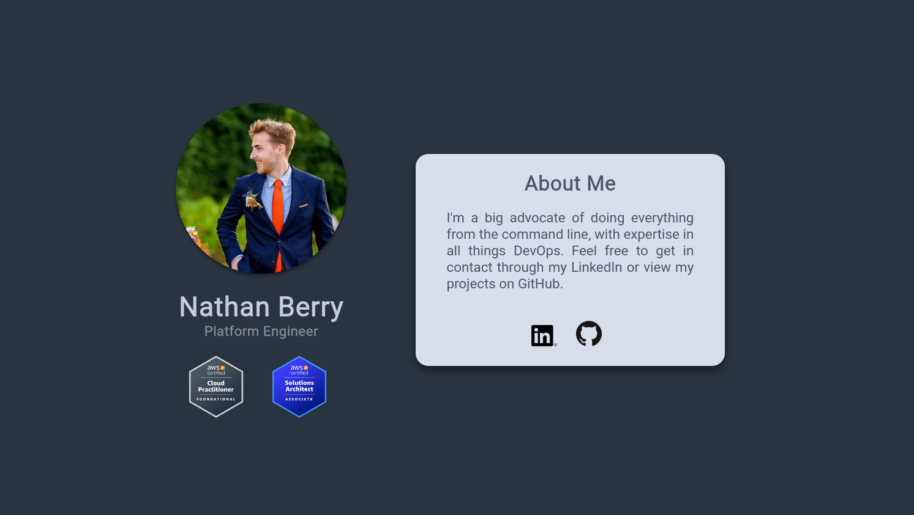
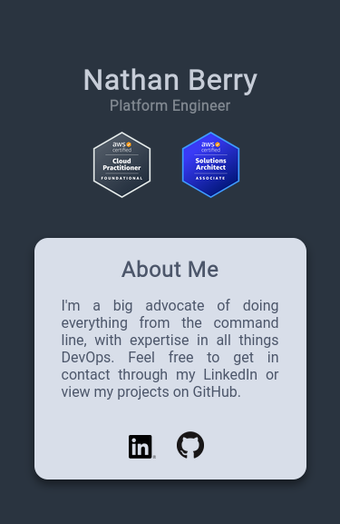

# Personal website

A simple webpage hosted through CloudFront in AWS and deployed through GitHub
Actions using IaC (AWS CDK)

## Website

The intended use of the page is to act like a simple landing page which points
the user to different webpages such as github and linkedin.
The colour scheme of the website is inspired from the vim nord theme.

The webpage is created with the following:

- HTML
- CSS

### web browser preview



### mobile preview

<p align="center">
  
</p>

## AWS CDK

To deploy the infrastructure you need to cd into the infra directory and run
the following commands:

```shell
npm ci
npm run build
npx cdk deploy
```

> **Note** you need to set aws account number and region in your environment
> vars make sure they are the following `export ACCOUNT_NUM=xxxxxxxxxxxx` and 
> `export REGION=eu-west-2`

### GitHub actions

The repo has been configured to automatically deploy any changes to the source
code or infrastructure on any changes to the main branch.

### Useful commands

* `npm run build`   compile typescript to js
* `npm run watch`   watch for changes and compile
* `npm run test`    perform the jest unit tests
* `npx cdk deploy`  deploy this stack to your default AWS account/region
* `npx cdk diff`    compare deployed stack with current state
* `npx cdk synth`   emits the synthesized CloudFormation template

